# SafeStaff AI — ER Wait-Time Forecasting and Nurse-Staffing Decision Support

SafeStaff AI is an agentic AI capstone prototype for emergency-room operations. It combines an XGBoost ER wait-time forecast, operational pressure modules, a nurse registry, a shift schedule, a multi-agent shortage solver, human approval, and an audit log into one Streamlit control-tower workflow.

> **Prototype notice:** SafeStaff AI is a demonstration and decision-support prototype. It is not clinically validated and must not be used for real patient-care or staffing decisions without hospital governance, validation, security review, and human supervision. The system is intended to support nurse managers and staffing coordinators, not replace clinical or operational judgment.

[](LICENSE)

## Project Links

- **Live Demo:** https://safestaffai-production-dff0.up.railway.app/
- **GitHub Repository:** https://github.com/draculess99/SafeStaff_AI
- **LinkedIn:** https://www.linkedin.com/in/gammaconsult/
- **Portfolio:** https://draculess99.github.io/VET-VTO-Forecasting/

> **Prototype notice:** SafeStaff AI is a demonstration and decision-support prototype. It is not clinically validated and must not be used for real patient-care or staffing decisions without hospital governance, validation, security review, and human supervision. The system is intended to support nurse managers and staffing coordinators, not replace clinical or operational judgment.

---

## Project subtitle

**From ER wait-time forecasts to nurse-staffing decisions: an agentic AI control tower for hospital operations.**

---

## What problem does this solve?

Emergency departments face changing demand: arrival surges, boarding delays, nurse fatigue, flu activity, staff call-outs, low-acuity bottlenecks, and limited specialist availability. A static staffing plan can miss these fast-moving pressures.

SafeStaff AI addresses two connected problems:

1. **ER wait-time forecasting**  
   An XGBoost model forecasts ER wait-time risk from structured operational features.

2. **Nurse-staffing decision support**  
   A staffing workflow converts the wait-time prediction and operational pressure signals into an explainable additional-nurse recommendation.

The app is designed to show a complete decision path:

```text
ER scenario inputs
    ↓
XGBoost wait-time forecast
    ↓
Operational pressure engine
    ↓
Pressure-based staffing adjustment
    ↓
Multi-agent shortage solver
    ↓
Human approval / rejection / override
    ↓
Roster update + audit log
```

---

## Application Walkthrough

The screenshots below show the SafeStaff AI workflow from ER pressure detection through staffing recommendation, agentic review, human approval, roster update, and audit traceability.

### 1. Control Tower Overview

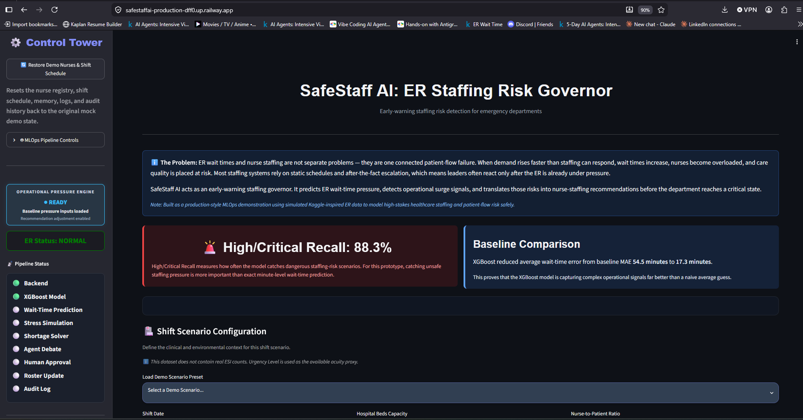

The Control Tower provides the main operational dashboard, including ER status, pipeline readiness, backend connection, model status, and the current operational pressure state.

### 2. Demo Scenario Inputs

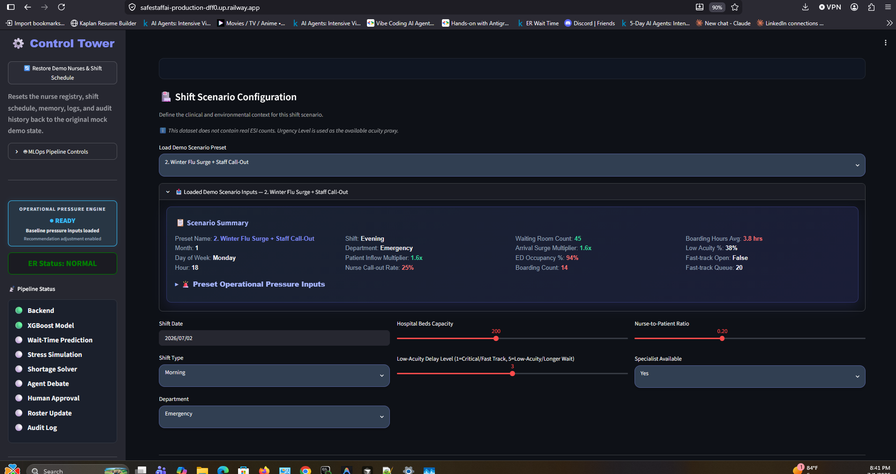

The demo scenario screen loads operational stress cases such as winter flu surge, staff call-outs, high boarding, high occupancy, fast-track pressure, and increased patient volume.

### 3. Shift Schedule & Status

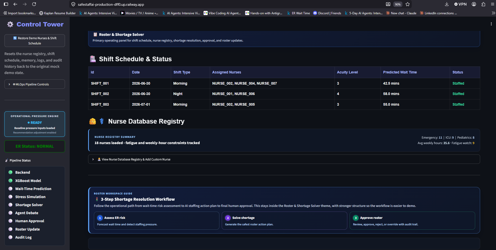

The shift schedule shows the active roster, assigned nurses, acuity level, predicted wait time, and staffing status before and after a recommended roster update.

### 4. Nurse Database Registry

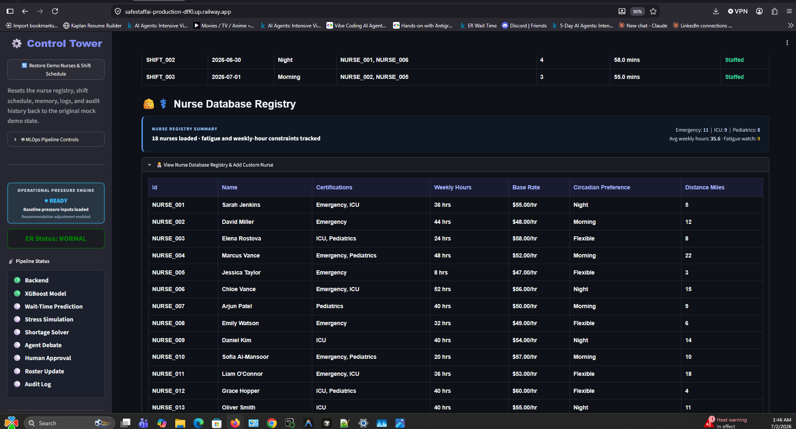

The nurse registry provides the staffing pool used by the shortage solver, including nurse availability, department fit, fatigue limits, and credential matching.

### 5. Step 1: ER Wait-Time Risk Assessment

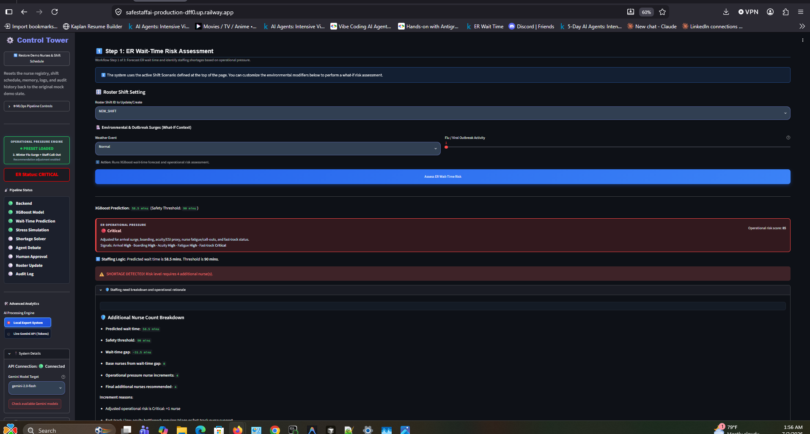

Step 1 uses the XGBoost model to predict ER wait time and combines that forecast with operational pressure signals to classify the current staffing risk.

### 6. Step 2: Pressure-Based Staffing Adjustment

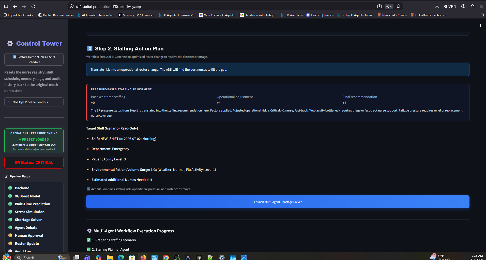

Step 2 separates the base wait-time staffing need from the operational adjustment, then produces the final additional-nurse recommendation.

### 7. Multi-Agent Workflow Execution Progress

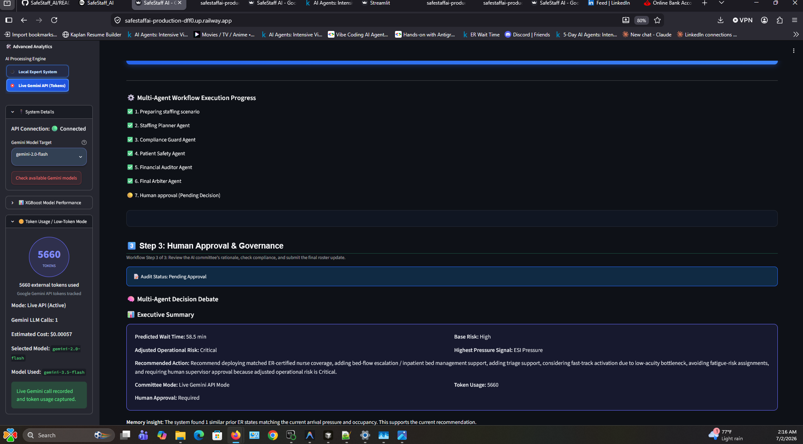

The multi-agent workflow shows the staffing recommendation being reviewed by the planner, compliance guard, patient safety agent, financial auditor, final arbiter, and human approval checkpoint.

### 8. Final Decision Executive Summary

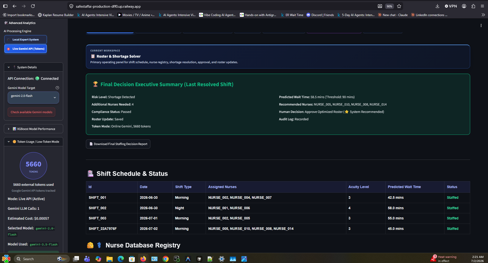

The final decision summary records whether the optimized roster was approved or rejected, confirms the roster update result, and shows whether the audit log was recorded.

### 9. Human Decision Audit Log

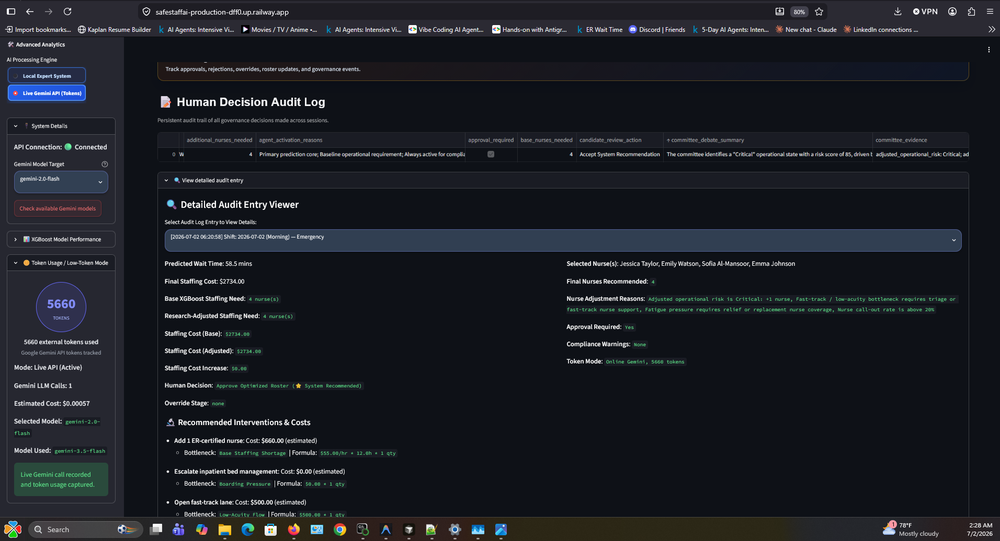

The audit log stores a persistent record of each staffing decision, including predicted wait time, staffing need, selected nurses, cost impact, approval status, compliance warnings, and decision rationale.

### 10. Explainability Reports & Cost Analytics

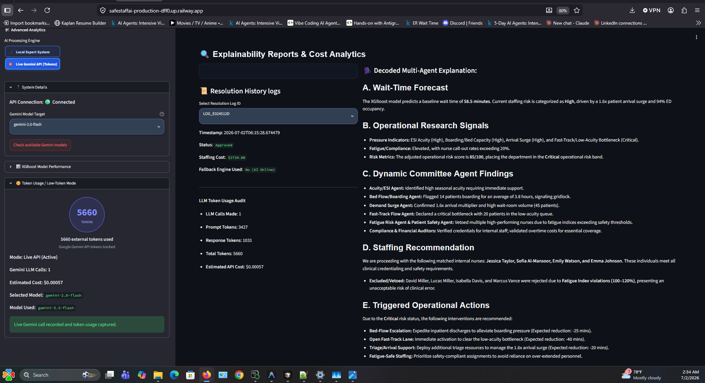

The explainability and cost analytics screen shows the resolution history, LLM token usage audit, estimated API cost, local-vs-live reasoning mode, and decoded multi-agent explanation.

---

## Core workflow

### 1. Roster & Shortage Solver

The primary workflow tab displays the operational staffing flow:

- Shift Schedule & Status
- Nurse Database Registry summary and expandable registry table
- 3-Step Shortage Resolution Workflow
- ER wait-time risk assessment
- Pressure-based staffing adjustment
- Multi-agent shortage solver
- Human approval and governance
- Final decision executive summary

### 2. System Stress Simulator

The simulator allows testing different ER pressure scenarios, such as flu surge, high boarding, fast-track closure, nurse call-outs, and high occupancy.

### 3. Explainability & Token Logs

This tab surfaces model reasoning, token usage, local-vs-live mode, and evidence for why recommendations changed.

### 4. Audit Log

The audit log records approvals, rejections, overrides, staffing recommendations, token mode, and governance status.

### 5. Research & Validation

This tab documents prototype validation, research modules, and operational pressure source checks.

### 6. AI Committee Debate & Planner

This tab shows the agentic reasoning layer, including planner, compliance, patient safety, finance, and final arbiter logic.

### 7. Model Performance

This tab shows XGBoost performance, baseline comparison, feature importance, and model evaluation results.

---

## Architecture diagram

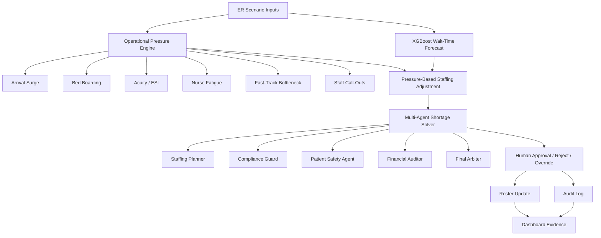


---

## Data Sources and Operational Pressure Modules

SafeStaff AI uses public/Kaggle-derived and simulated proxy data for demonstration. The project does **not** use real patient records, protected health information, or live hospital staffing data.

The main ER wait-time forecasting model is based on the Kaggle **ER Wait Time** dataset by Rivalytics:

[Dataset source: Kaggle — ER Wait Time by Rivalytics](https://www.kaggle.com/datasets/rivalytics/er-wait-time)

This dataset is used to train the XGBoost wait-time forecasting model. The model predicts ER wait-time risk from structured operational features such as acuity, timing, patient-flow patterns, and wait-time dynamics.

In addition to the main wait-time dataset, SafeStaff AI includes prototype operational pressure modules. These modules are not separate clinical prediction models. They are research-inspired lookup tables and rule-based pressure signals used to simulate common emergency department staffing pressures.

| Operational module | What it represents | Prototype source |
|---|---|---|
| ESI Seasonal Patterns | Acuity and urgency pressure | Mapped from Kaggle-derived ER urgency levels |
| Bed Boarding Pressure | Boarding and inpatient bed-flow pressure | Proxy generated from wait-time patterns by hour, day, and month |
| Arrival Surge Pressure | Patient volume surge pressure | Aggregated from visit counts and wait-time patterns |
| Fast-Track Flow | Low-acuity bottleneck and fast-track pressure | Aggregated from low-urgency visit counts and queue-size proxies |
| Nurse Fatigue / Call-Out Rules | Staffing safety and coverage pressure | Simulated operational rules for demo staffing constraints |

These modules are stored in the `database/` folder and documented in the app’s Data Sources Registry. They help explain why the final nurse recommendation may be higher than the raw XGBoost wait-time prediction alone.

Because these are prototype research modules, they would need to be replaced, calibrated, and clinically validated with real hospital operational data before production use.

---

## Data and Decision Flow

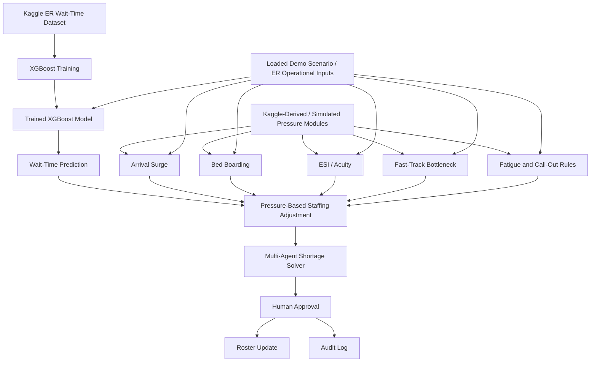

This diagram separates the historical/proxy data used to train the XGBoost model from the current demo scenario loaded in the application. The loaded scenario represents the current ER operational state, while the Kaggle-derived data and prototype pressure modules provide the forecasting and decision-support logic used to produce the staffing recommendation.

---

## Key features

### XGBoost ER wait-time forecasting

The XGBoost model produces the base wait-time forecast. The model performance tab compares XGBoost against a naive mean baseline.

Example saved model metrics from `backend/model_metrics.json`:

| Metric | XGBoost | Naive Mean Baseline |
|---|---:|---:|
| MAE | 17.28 minutes | 54.51 minutes |
| RMSE | 26.18 minutes | 68.21 minutes |
| R² | 0.853 | -0.0002 |

The baseline predicts the average wait time for every case. XGBoost beating that baseline shows the model is learning useful operational patterns.

### Operational Pressure Engine

The operational pressure engine is loaded at startup and applies baseline pressure modules to adjust the staffing recommendation.

It considers signals such as:

- arrival surge multiplier
- bed boarding count and boarding hours
- ED occupancy
- patient acuity
- nurse call-out rate
- fast-track status and fast-track queue
- fatigue and maximum-hour constraints
- specialist availability

The sidebar uses a readiness indicator:

```text
OPERATIONAL PRESSURE ENGINE
● READY
Baseline pressure inputs loaded
Recommendation adjustment enabled
```

When a demo preset is loaded, the app shows:

```text
OPERATIONAL PRESSURE ENGINE
● PRESET LOADED
[preset name]
Recommendation adjustment enabled
```

### Pressure-based staffing adjustment

SafeStaff separates the raw wait-time prediction from the operational adjustment:

```text
Base wait-time staffing: +N
Operational adjustment: +M
Final recommendation: +K
```

This makes the recommendation easier to defend because users can see whether the nurse count came from the model, the operational rules, or both.

### Multi-agent shortage solver

The shortage solver represents a committee-style staffing workflow:

- **Staffing Planner Agent** — generates the initial staffing plan.
- **Compliance Guard Agent** — checks constraints such as safe hours and approval rules.
- **Patient Safety Agent** — evaluates risk escalation and safe coverage.
- **Financial Auditor Agent** — estimates staffing cost impact.
- **Final Arbiter Agent** — produces the final recommendation.
- **Human Approval** — supervisor approves, rejects, or overrides.

### Human-in-the-loop governance

The app does not make autonomous clinical staffing decisions. High-risk recommendations are routed to a human approval step.

Supported actions:

- approve recommendation
- reject recommendation
- override recommendation
- save roster update
- record audit log

### Audit trail

The audit log records decision traces such as:

- additional nurses needed
- base staffing need
- final recommendation
- active agents
- decision status
- approval requirement
- human decision
- token mode
- cost estimate

This supports governance, traceability, and demo explainability.

### Local Expert System vs Live Gemini mode

SafeStaff supports two reasoning modes. This is intentional: the app can run in low-token deterministic mode for reliability and cost control, while Live Gemini mode can add richer narrative reasoning when quota and API access are available.

#### Local / low-token mode

```text
Tokens: 0
Local deterministic expert system
No paid external LLM tokens used
```

This mode is reliable for demos because it does not depend on API quota.

#### Live Gemini API mode

```text
Gemini LLM Calls: 1
Tokens: [tracked count]
Estimated Cost: [estimated cost]
Model Used: [successful model]
```

Live mode adds richer narrative reasoning and token/cost transparency. If quota, network access, or model availability fails, SafeStaff falls back to the local deterministic expert-system mode so the workflow remains demo-safe, cost-controlled, and explainable.

---

## Repository structure

```text
SafeStaff_AI/
├── backend/                 # Flask API, XGBoost model logic, agents, pressure modules
├── frontend/                # Streamlit dashboard
├── database/                # Mock nurse registry, schedule, audit logs, demo data
├── assets/screenshots/      # Application walkthrough images
├── scripts/                 # Data/module build scripts
├── requirements.txt         # Python dependencies
└── server.py                # Root backend entry point for deployment
```

---

## Local installation

```bash
git clone <your-repo-url>
cd SafeStaff_AI
python -m venv .venv
```

Activate the environment.

Windows:

```bash
.venv\Scripts\activate
```

macOS/Linux:

```bash
source .venv/bin/activate
```

Install dependencies:

```bash
pip install -r requirements.txt
```

---

## Run locally

Backend:

```bash
python server.py
```

or:

```bash
gunicorn backend.server:app --bind 0.0.0.0:5000 --timeout 180 --workers 1
```

Frontend:

```bash
streamlit run frontend/dashboard.py --server.address 0.0.0.0 --server.port 8501
```

Set the frontend backend URL if needed:

```bash
API_BASE_URL=http://localhost:5000
BACKEND_URL=http://localhost:5000
```

---

## Railway deployment

Use two Railway services.

### Backend service

Custom start command:

```bash
sh -c "gunicorn backend.server:app --bind 0.0.0.0:$PORT --timeout 180 --workers 1"
```

Set variables if using Live Gemini mode:

```text
GOOGLE_API_KEY=<your-key>
GEMINI_API_KEY=<your-key>
GOOGLE_GENAI_API_KEY=<your-key>
```

Only one valid Gemini key is required, but the app checks multiple common variable names.

### Frontend service

Custom start command:

```bash
sh -c "streamlit run frontend/dashboard.py --server.address 0.0.0.0 --server.port $PORT"
```

Frontend variables:

```text
API_BASE_URL=https://YOUR-BACKEND-RAILWAY-URL.up.railway.app
BACKEND_URL=https://YOUR-BACKEND-RAILWAY-URL.up.railway.app
```

---

## Useful API endpoints

```text
GET  /api/health
GET  /api/nurses
GET  /api/schedule
POST /api/reset
POST /api/predict_wait
POST /api/resolve_shortage
POST /api/approve_resolution
POST /api/reject_resolution
GET  /api/audit_logs
GET  /api/model-evaluation
POST /api/train
POST /api/retrain_and_reload
GET  /api/inflow-memory
POST /api/inflow-forecast
POST /api/update_memory_on_save
GET  /api/inflow-history
POST /api/find_similar_history
GET  /api/gemini-config
GET  /api/gemini-models
```

Quick backend checks:

```bash
curl https://YOUR-BACKEND-URL.up.railway.app/api/health
curl https://YOUR-BACKEND-URL.up.railway.app/api/nurses
curl https://YOUR-BACKEND-URL.up.railway.app/api/schedule
```

---

## Demo walkthrough

1. Open the Streamlit dashboard.
2. Confirm pipeline status is green.
3. Confirm the Operational Pressure Engine is ready.
4. Load a demo scenario such as **Winter Flu Surge + Staff Call-Out**.
5. Review the demo scenario inputs and operational pressures.
6. Run **Step 1: ER Wait-Time Risk Assessment**.
7. Review XGBoost wait-time prediction and ER operational pressure.
8. Review **Step 2: Pressure-Based Staffing Adjustment**.
9. Launch the **Multi-Agent Shortage Solver**.
10. Approve, reject, or override the staffing recommendation.
11. Confirm the shift schedule updates when approved.
12. Open the Audit Log and verify the decision was recorded.
13. Optionally switch between Local Expert System and Live Gemini mode.

---

## Testing

Targeted tests:

```bash
python backend/test_research_modules.py
python backend/smoke_test_app.py
python backend/test_inflow_memory_persistence.py
python backend/test_models.py
```

Pytest examples:

```bash
pytest backend/test_inflow_memory_persistence.py -q
pytest backend/test_models.py -q
pytest backend/test_research_modules.py -q
```

---

## What makes this agentic?

SafeStaff AI is agentic because it performs a multi-step decision workflow instead of returning a single prediction:

1. Reads the current ER scenario.
2. Runs an ML wait-time forecast.
3. Applies operational pressure modules.
4. Converts pressure into staffing adjustment.
5. Runs agent-style planning, compliance, safety, finance, and arbiter logic.
6. Routes high-risk decisions to human approval.
7. Saves schedule, nurse-hour, and audit updates.
8. Provides explainability and token/cost transparency.

---

## Safety and limitations

SafeStaff AI is a prototype and should not be used for real clinical staffing decisions without:

- clinical validation
- real hospital data review
- governance approval
- bias and safety testing
- monitoring for model drift
- security and privacy review
- integration with hospital staffing policy
- human supervisor accountability

Current limitations:

- Data is simulated or Kaggle-derived proxy data.
- The model is not clinically validated.
- Operational modules are prototype rules and lookup tables.
- Nurse-cost calculations are simplified.
- Gemini API usage depends on quota and API availability.
- The app is built for capstone/demo evaluation, not production deployment.

---

## Future Improvements / Production Hardening

SafeStaff AI is currently designed as a capstone prototype that demonstrates ER wait-time forecasting, operational pressure adjustment, nurse staffing recommendations, human approval, and audit logging. To move this from a prototype into a production-grade healthcare operations system, several improvements would be required.

In short, productionizing SafeStaff AI would require replacing local JSON state with a managed database, adding authentication and role-based access, hardening security, validating the model on real hospital data, strengthening audit logs, and integrating with hospital scheduling, staffing, and operational data systems.

### 1. Move Local JSON State to a Production Database

The current prototype uses local JSON-based state for mock nurses, shift schedules, memory, audit logs, and workflow history. In production, this should be moved to a managed database such as PostgreSQL, Cloud SQL, Firestore, or another healthcare-approved data store.

Production database improvements would include:

- Persistent nurse registry storage
- Persistent shift schedule history
- Persistent memory state across deployments
- Persistent audit logs and human approval records
- Transaction-safe roster updates
- Rollback support for failed approvals or overrides
- Role-based access to staffing, audit, and administrative records
- Backup and disaster recovery policies

This would make the system scalable, reliable, and safer across multiple users, departments, and hospital sites.

### 2. Store Memory State in a Database

The current memory layer is useful for demonstrating agentic behavior, but production memory should not depend on local runtime files. Memory should be stored in a database with clear retention rules.

Future memory improvements:

- Store patient-flow memory, inflow history, staffing decisions, and prior operational states in a database
- Add timestamps, versioning, and source attribution for every memory record
- Separate short-term session memory from long-term operational memory
- Add memory expiration and retention policies
- Prevent unsafe memory reuse across unrelated hospitals, departments, or shifts
- Add audit trails showing when memory was read, written, or used by an agent

This would make the memory system more trustworthy and easier to govern.

### 3. Add Stronger Security and Input Guardrails

The prototype should be hardened against common web security risks before production deployment.

Recommended security improvements:

- Add input validation on all API routes
- Sanitize user-entered text to reduce cross-site scripting risk
- Escape or clean any text rendered back into Streamlit
- Add schema validation for nurse, schedule, prediction, and approval payloads
- Add request size limits
- Add rate limiting on API endpoints
- Add authentication and role-based authorization
- Add CSRF protection if browser-based authenticated forms are used
- Add secure handling for API keys and secrets
- Add logging for suspicious or malformed requests

This would help protect the system from unsafe input, accidental misuse, and malicious requests.

### 4. Production Agent Guardrails

The current agent workflow demonstrates staffing planner, compliance, patient safety, financial audit, and final arbiter behavior. In production, each agent would need stricter guardrails.

Future agent guardrails:

- Require every agent recommendation to cite the data used
- Prevent agents from overriding hospital staffing policy without human approval
- Add hard safety limits for nurse fatigue and maximum weekly hours
- Add compliance checks for credential matching and department qualification
- Add escalation rules for high-risk recommendations
- Require human approval before schedule changes are committed
- Separate advisory output from executable roster updates
- Log every agent decision, input, and output
- Add confidence scoring and uncertainty flags
- Add fallback behavior when LLM APIs fail or quota is unavailable

This ensures that agents support human decision-making rather than replacing it.

### 5. Human-in-the-Loop Governance

SafeStaff AI should remain a decision-support system, not an autonomous staffing authority. Production use would require stronger governance around approvals.

Production governance improvements:

- Require supervisor sign-off for staffing changes
- Add approval roles such as charge nurse, staffing coordinator, and administrator
- Track approve, reject, override, and escalate decisions
- Store decision rationale with each approval
- Add immutable audit logs
- Add downloadable decision reports
- Add notification workflows for approved roster changes
- Add review queues for high-risk staffing events

This would make the system safer and more accountable.

### 6. Better Audit Logging and Compliance Reporting

The current audit log demonstrates governance, but production audit logging should be more structured and tamper-resistant.

Future audit improvements:

- Store audit logs in a database rather than local files
- Add immutable append-only audit records
- Track user identity, timestamp, action, and affected schedule
- Track model version and agent version used in each decision
- Track whether the decision used local mode or Live Gemini mode
- Track token usage and external API calls
- Add exportable compliance reports
- Add search and filtering across audit history

This would improve transparency and support operational review.

### 7. Model Monitoring and MLOps

The current XGBoost model demonstrates ER wait-time forecasting. Production deployment would require stronger model monitoring.

Recommended MLOps improvements:

- Track model version, training dataset, and feature set
- Monitor prediction drift over time
- Compare predicted wait times against actual wait times
- Add automated model performance dashboards
- Add retraining pipelines
- Add model rollback support
- Add baseline model comparison
- Add alerting when model error increases
- Add fairness and bias review for staffing recommendations

This would make the forecasting system more reliable over time.

### 8. Replace Mock Data With Real Hospital Data Integrations

The current system uses mock nurse registry and demo shift schedule data. A production system would need integration with real hospital systems.

Potential integrations:

- Electronic health record systems
- Staffing and scheduling platforms
- Bed management systems
- ER arrival and triage systems
- Nurse credentialing systems
- Timekeeping and fatigue tracking systems
- Hospital operations dashboards

These integrations would allow the operational pressure engine to work from live hospital data rather than simulated demo inputs.

### 9. Multi-User and Multi-Site Support

The prototype is designed around a single workflow instance. Production use would require support for multiple users, departments, and hospitals.

Future scaling improvements:

- Multi-user login
- Multi-hospital configuration
- Department-specific staffing rules
- Site-specific nurse pools
- Per-shift access controls
- Concurrent approval workflows
- Database-backed session state
- Cloud-hosted persistent storage
- Environment-specific configuration for dev, staging, and production

This would allow SafeStaff AI to scale beyond a single demo environment.

### 10. Safer Live LLM Usage

SafeStaff AI supports local deterministic mode and Live Gemini mode. Production LLM use should include stronger controls.

Recommended LLM improvements:

- Keep local deterministic mode as the safe fallback
- Add quota and failure detection for live LLM calls
- Add model availability checks before running a workflow
- Add prompt injection protections
- Restrict LLMs from directly modifying schedules
- Store prompts, responses, token usage, and cost in audit logs
- Validate LLM outputs against schemas before using them
- Use LLM output as explanation and reasoning support, not as the sole decision authority

This keeps the system useful while reducing operational risk.

### 11. Deployment and Infrastructure Improvements

The current Railway deployment is appropriate for a prototype. A production deployment would need stronger infrastructure.

Production infrastructure improvements:

- Separate frontend and backend services
- Managed production database
- Secret management
- HTTPS-only traffic
- Health checks and uptime monitoring
- Centralized logging
- Error monitoring
- CI/CD pipeline
- Automated tests before deployment
- Staging environment before production
- Containerized deployment with Docker
- Backup and rollback strategy

This would make the application more reliable and easier to maintain.

### 12. Testing Improvements

Before production use, the system should include automated tests for the full staffing workflow.

Recommended tests:

- Unit tests for operational pressure rules
- Unit tests for nurse eligibility and fatigue constraints
- API tests for prediction, schedule, nurse registry, reset, approval, and audit routes
- Frontend workflow tests
- End-to-end approval tests
- Security tests for unsafe input
- Regression tests for cache invalidation
- Tests for local mode and Live Gemini fallback behavior

This would reduce the chance of workflow bugs during demos or deployment.

### Summary

The current version of SafeStaff AI demonstrates the core idea: combining XGBoost wait-time forecasting, operational pressure rules, agentic staffing recommendations, human approval, and audit logging. The next stage would be to move state into a production database, strengthen security guardrails, add persistent memory, improve auditability, harden agent behavior, and integrate with real hospital data systems.

---

## One-line summary

**SafeStaff AI turns ER wait-time forecasts into explainable nurse-staffing decisions by combining XGBoost, operational pressure modules, agent-style reasoning, human approval, and audit logging.**
