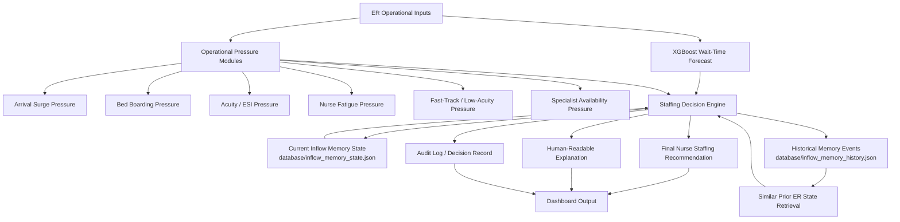

# SafeStaff AI: ER Wait-Time Forecasting and Nurse-Staffing Decision Support

SafeStaff AI is an agentic decision-support prototype for emergency-room operations. It forecasts ER wait-time risk with XGBoost, combines that forecast with operational pressure signals, and produces an explainable nurse-staffing recommendation.

The project is designed for a GitHub/Kaggle-style capstone submission: it demonstrates machine-learning forecasting, operational decision support, persistent memory, auditability, human-in-the-loop review, and a Streamlit dashboard.

---

## Project subtitle

**From ER wait-time forecasts to nurse-staffing decisions: an agentic AI decision-support system.**

---

## What problem does this solve?

Emergency departments often face unpredictable patient arrivals, long wait times, bed boarding, staff fatigue, and staffing shortages. A static roster does not always respond well to changing operational pressure.

SafeStaff AI addresses two connected problems:

1. **ER wait-time forecasting**  
   The XGBoost model predicts ER wait-time risk from operational features such as patient urgency, hospital size, staffing ratio, time of day, shift type, seasonality, and historical wait patterns.

2. **Nurse-staffing decision support**  
   The staffing engine converts the wait-time forecast, operational pressure modules, and memory of similar prior ER states into an explainable additional-nurse recommendation.

The system does **not** claim to replace clinical judgment. It is a decision-support prototype intended to make staffing risk more visible, explainable, and auditable.

---

## Core workflow

```text
Current ER scenario
        ↓
XGBoost wait-time prediction
        ↓
Baseline comparison and model explainability
        ↓
Operational pressure modules
        ↓
Research-adjusted staffing rationale
        ↓
Persistent memory lookup for similar prior ER states
        ↓
Final nurse-staffing recommendation
        ↓
Human supervisor approval / override
        ↓
Audit log
```

---

## Architecture diagram



The system combines a machine-learning wait-time forecast with operational pressure modules and persistent memory. XGBoost predicts ER wait-time risk, while the staffing decision engine converts the forecast, pressure signals, and similar prior memory events into an explainable nurse-staffing recommendation. Current memory stores the latest operational state, while historical memory stores prior ER events for similar-case retrieval.

---

## Key features

### 1. XGBoost ER wait-time forecasting

The model predicts ER patient wait time from structured operational features.

Current saved model metrics from `backend/model_metrics.json`:

| Metric | XGBoost | Naive Mean Baseline |
|---|---:|---:|
| MAE | 17.28 minutes | 54.51 minutes |
| RMSE | 26.18 minutes | 68.21 minutes |
| R² | 0.853 | -0.0002 |

The baseline is a **naive mean baseline**. It predicts the training-set average wait time for every case. XGBoost significantly outperforms this baseline, showing that the model is learning useful operational patterns rather than simply guessing the average.

---

### 2. Nurse-staffing recommendation engine

The staffing layer converts forecasted wait-time risk into an additional-nurse recommendation.

It considers:

- XGBoost predicted wait time
- Base staffing risk
- Arrival surge pressure
- ESI / acuity pressure
- Bed boarding pressure
- Fast-track / low-acuity bottlenecks
- Nurse fatigue pressure
- Nurse call-out pressure
- Specialist availability
- Operational risk level
- Human supervisor approval requirements

Important distinction:

> XGBoost forecasts ER wait time. The staffing engine uses that forecast plus operational pressure signals to recommend additional nurse staffing.

---

### 3. Research / operational pressure modules

The app includes operational modules that add context beyond the base ML forecast:

- `arrival_surge_pressure.csv`
- `bed_boarding_pressure.csv`
- `esi_seasonal_patterns.csv`
- `fast_track_flow.csv`
- intervention-cost catalog
- data-source registry

These modules help explain why staffing may need to be maintained, increased, or escalated to supervisor review.

---

### 4. Persistent inflow memory

SafeStaff AI includes persistent memory for ER inflow and staffing context.

Current memory state:

```text
database/inflow_memory_state.json
```

Append-only memory history:

```text
database/inflow_memory_history.json
```

The current memory file stores the latest operational memory state. The history file stores prior memory events so the system can retrieve similar ER states later.

The memory layer supports questions such as:

- Have we seen a similar ER pressure pattern before?
- Did a previous similar event underpredict load?
- Did similar prior conditions require additional staffing?
- Does historical context support the current recommendation?

In this version, memory is used as a **decision-support and explainability layer**. It retrieves similar prior ER states and displays a memory insight. It does not directly override the final nurse-count calculation.

---

### 5. Similar prior ER memory events

The system can search prior memory history for events similar to the current ER state.

Similarity can consider:

- arrival pressure
- boarding pressure
- fatigue pressure
- acuity pressure
- ED occupancy percentage
- waiting-room count
- forecasted load
- prior staffing recommendation

Example explanation:

```text
Memory insight: The system found similar prior ER states with high occupancy and critical arrival pressure. Those events support the current staffing recommendation.
```

If no similar history exists, the system explains that the recommendation is based on the current forecast and operational pressure signals.

---

### 6. Explainability dashboard

The Streamlit dashboard includes:

- XGBoost predicted wait time
- Base staffing risk
- Research-adjusted staffing rationale
- Final recommended nurse count
- Why the recommendation changed or was maintained
- Baseline vs XGBoost comparison
- Feature importance chart with readable feature names
- Memory state
- Recent inflow memory history
- Similar prior ER memory events
- Audit log
- Research validation tab
- AI committee debate / planner tab
- MLOps-style retraining controls

---

### 7. Human-in-the-loop governance

High-risk recommendations are routed through a supervisor approval workflow. The app includes approve/reject actions and audit logging so staffing decisions are traceable.

This is important because the project is not designed to make autonomous clinical staffing decisions. It is designed to support human decision-makers.

---

## Dashboard tabs

The app dashboard includes the following major areas:

1. **Roster & Shortage Solver**  
   Main operational screen for nurse registry, schedule view, shortage resolution, memory visibility, and staffing recommendation.

2. **System Stress Simulator**  
   Demo scenarios for testing pressure conditions and stress cases.

3. **Explainability & Token Logs**  
   Displays reasoning, local fallback behavior, and token/cost transparency.

4. **Audit Log**  
   Tracks approvals, rejections, and decision events.

5. **Research & Validation**  
   Shows research module checks, smoke tests, data-source notes, and validation utilities.

6. **AI Committee Debate & Planner**  
   Displays the agentic reasoning layer, intervention planning, and committee-style recommendation discussion.

7. **Model Performance**  
   Shows XGBoost metrics, baseline comparison, feature importances, and model evaluation details.

---

## Data and privacy statement

This project uses simulated, synthetic, and Kaggle-derived proxy data for demonstration.

No real patient records are required. No PHI should be committed to the repository.

Relevant data files are stored under:

```text
database/
```

Key files include:

```text
database/er_wait_time.csv
database/ER Wait Time Dataset.csv
database/arrival_surge_pressure.csv
database/bed_boarding_pressure.csv
database/esi_seasonal_patterns.csv
database/fast_track_flow.csv
database/data_sources.json
```

---

## Repository structure

```text
nurse_staffing_system/
├── app.py                          # Starts Flask backend and Streamlit frontend
├── requirements.txt                # Python dependencies
├── backend/
│   ├── server.py                   # Flask API routes
│   ├── model.py                    # XGBoost training/evaluation logic
│   ├── xgboost_model.pkl           # Saved trained model
│   ├── model_metrics.json          # Saved model and baseline metrics
│   ├── inflow_memory.py            # Current memory, history, and similar-event retrieval
│   ├── research_modules.py         # Operational pressure modules
│   ├── intervention_costing.py     # Cost-impact calculations
│   ├── agents/
│   │   └── adk_agents.py           # Agentic debate/planner logic
│   └── test_*.py                   # Targeted backend tests
├── frontend/
│   └── dashboard.py                # Streamlit dashboard
├── database/
│   ├── db.json                     # Mock operational database and audit state
│   ├── inflow_memory_state.json    # Latest current inflow memory
│   ├── inflow_memory_history.json  # Append-only memory history
│   └── *.csv / *.json              # Simulation and research-module data
└── scripts/
    └── build_research_modules_from_kaggle.py
```

---

## Installation

### 1. Clone the repository

```bash
git clone <your-repo-url>
cd nurse_staffing_system
```

### 2. Create a virtual environment

```bash
python -m venv .venv
```

Activate it:

Windows:

```bash
.venv\Scripts\activate
```

macOS/Linux:

```bash
source .venv/bin/activate
```

### 3. Install dependencies

```bash
pip install -r requirements.txt
```

---

## How to run the app

From the project root:

```bash
python app.py
```

This starts:

- Flask API backend: `http://127.0.0.1:5000`
- Streamlit dashboard: `http://localhost:8501`

Open the Streamlit URL in your browser.

---

## Useful API endpoints

The backend exposes endpoints such as:

```text
GET  /health
GET  /api/nurses
GET  /api/schedule
POST /api/predict_wait
POST /api/resolve_shortage
POST /api/approve_resolution
POST /api/reject_resolution
GET  /api/audit_logs
POST /api/train
POST /api/retrain_and_reload
GET  /api/inflow-memory
POST /api/inflow-forecast
POST /api/update_memory_on_save
GET  /api/inflow-history
POST /api/find_similar_history
GET  /api/model-evaluation
```

---

## Testing

Run targeted validation tests from the project root.

Research-module validation:

```bash
python backend/test_research_modules.py
```

Smoke test:

```bash
python backend/smoke_test_app.py
```

Memory persistence test:

```bash
python backend/test_inflow_memory_persistence.py
```

Model tests:

```bash
python backend/test_models.py
```

You can also run pytest if installed:

```bash
pytest backend/test_inflow_memory_persistence.py -q
pytest backend/test_models.py -q
pytest backend/test_research_modules.py -q
```

---

## Demo walkthrough

1. Start the app with:

   ```bash
   python app.py
   ```

2. Open:

   ```text
   http://localhost:8501
   ```

3. Load or adjust an ER scenario.

4. Review the XGBoost predicted wait time.

5. Review the base staffing risk and research-adjusted staffing rationale.

6. Check whether the final nurse recommendation was changed or maintained.

7. Open the memory sections:

   - Current inflow memory state
   - Recent inflow memory history
   - Similar prior ER memory events

8. Review the model performance tab:

   - XGBoost metrics
   - Naive mean baseline comparison
   - Feature importance chart

9. Open the audit log to confirm decisions are traceable.

10. Use the supervisor approval / override workflow for high-risk decisions.

---

## What makes this agentic?

This project is agentic because it does more than return a single model prediction.

It performs a multi-step decision workflow:

1. Reads the current ER scenario.
2. Runs an ML forecast.
3. Evaluates operational pressure modules.
4. Retrieves similar prior memory events.
5. Generates an explainable staffing recommendation.
6. Produces committee-style reasoning and intervention planning.
7. Routes high-risk decisions to human approval.
8. Saves decision traces to memory and audit logs.

---

## Model explainability

The app includes feature importance reporting so users can see which operational factors influenced the XGBoost model most strongly.

Feature importance explains model behavior. It does not prove medical causation.

The model performance tab also includes a baseline comparison to show that XGBoost beats a simple non-ML benchmark.

---

## Safety and limitations

SafeStaff AI is a prototype.

It should not be used for real clinical staffing decisions without:

- real hospital validation
- clinical governance
- data-quality checks
- bias and safety review
- human supervisor control
- monitoring for model drift
- integration with hospital staffing policies

Current limitations:

- Data is simulated or Kaggle-derived proxy data.
- The model is not clinically validated.
- Memory supports explanation and decision context but does not override the nurse-count calculation in this version.
- Operational modules are prototype rules and lookup tables.
- Cost calculations are simplified for demonstration.
- The app is designed for capstone/demo purposes, not production hospital deployment.

---

## GitHub submission checklist

Before submitting, confirm:

- [ ] `README.md` is present and accurate.
- [ ] `requirements.txt` is present.
- [ ] App starts with `python app.py`.
- [ ] No `.env` secrets are committed.
- [ ] No real patient data is committed.
- [ ] `__pycache__`, `.pytest_cache`, and local junk files are removed or ignored.
- [ ] Architecture Mermaid diagram renders correctly on GitHub.
- [ ] Dashboard screenshots are added if desired.
- [ ] Baseline comparison is visible in the model performance tab.
- [ ] Feature importance chart uses readable names.
- [ ] Memory history and similar prior events are visible.
- [ ] The final demo story is clear: forecast wait time, explain risk, recommend staffing.

---

## Recommended `.gitignore`

```gitignore
__pycache__/
*.pyc
.pytest_cache/
.venv/
.env
.DS_Store
catboost_info/
*.log
```

Do not commit API keys, credentials, or private environment variables.

---

## Suggested screenshots

For a stronger GitHub submission, add screenshots under a `screenshots/` folder:

```text
screenshots/dashboard_main.png
screenshots/staffing_rationale.png
screenshots/model_performance.png
screenshots/memory_history.png
screenshots/audit_log.png
```

Then link them in this README.

---

## Final project summary

SafeStaff AI demonstrates how machine learning, operational research modules, persistent memory, and agentic reasoning can be combined into a practical ER staffing decision-support workflow.

The system forecasts ER wait-time risk, compares the model against a baseline, explains operational pressure, retrieves similar historical memory events, recommends additional nurse staffing, and preserves decisions through audit logs and human-in-the-loop approval.

