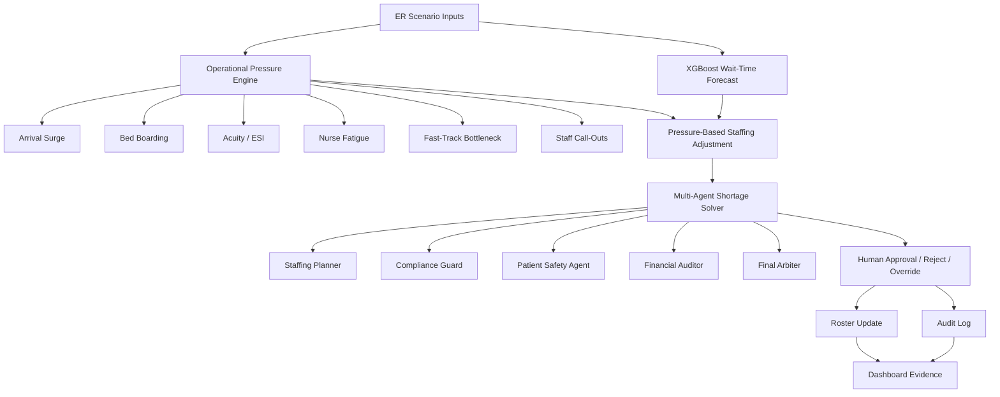

# SafeStaff AI — ER Wait-Time Forecasting and Nurse-Staffing Decision Support

SafeStaff AI is an agentic AI capstone prototype for emergency-room operations. It combines an XGBoost ER wait-time forecast, operational pressure modules, a nurse registry, a shift schedule, a multi-agent shortage solver, human approval, and an audit log into one Streamlit control-tower workflow.

> **Prototype notice:** SafeStaff AI is a demonstration and decision-support prototype. It is not clinically validated and must not be used for real patient-care or staffing decisions without hospital governance, validation, security review, and human supervision.

---

## Project subtitle

**From ER wait-time forecasts to nurse-staffing decisions: an agentic AI control tower for hospital operations.**

---

## What problem does this solve?

Emergency departments face changing demand: arrival surges, boarding delays, nurse fatigue, flu activity, staff call-outs, low-acuity bottlenecks, and limited specialist availability. A static staffing plan can miss these fast-moving pressures.

SafeStaff AI addresses two connected problems:

1. **ER wait-time forecasting**  
   An XGBoost model forecasts ER wait-time risk from structured operational features.

2. **Nurse-staffing decision support**  
   A staffing workflow converts the wait-time prediction and operational pressure signals into an explainable additional-nurse recommendation.

The app is designed to show a complete decision path:

```text
ER scenario inputs
    ↓
XGBoost wait-time forecast
    ↓
Operational pressure engine
    ↓
Pressure-based staffing adjustment
    ↓
Multi-agent shortage solver
    ↓
Human approval / rejection / override
    ↓
Roster update + audit log
```

---

## Screenshot checklist for the README

Add screenshots in this order so reviewers can understand the app quickly:

1. **Control Tower overview** — ER status, pipeline status, main workflow tab.
2. **Loaded demo scenario inputs** — flu surge, boarding, occupancy, call-outs, pressure inputs.
3. **Shift Schedule & Status** — shows the active schedule before/after a roster update.
4. **Nurse Database Registry summary** — shows nurses loaded and registry expander.
5. **Step 1: ER Wait-Time Risk Assessment** — XGBoost wait prediction and ER operational pressure.
6. **Step 2: Pressure-Based Staffing Adjustment** — base staffing, operational adjustment, final recommendation.
7. **Multi-Agent Workflow Execution Progress** — planner, compliance, safety, finance, arbiter, human approval.
8. **Final Decision Executive Summary** — approved/rejected decision and roster/audit result.
9. **Human Decision Audit Log** — persistent audit record.
10. **Token Usage / Low-Token Mode** — local deterministic mode vs Live Gemini token tracking.

Suggested README image folder:

```text
assets/screenshots/
```

Suggested image names:

```text
assets/screenshots/01-control-tower-overview.png
assets/screenshots/02-demo-scenario-inputs.png
assets/screenshots/03-shift-schedule-status.png
assets/screenshots/04-nurse-registry-summary.png
assets/screenshots/05-step1-wait-time-risk.png
assets/screenshots/06-step2-pressure-adjustment.png
assets/screenshots/07-agent-workflow-progress.png
assets/screenshots/08-final-decision-summary.png
assets/screenshots/09-audit-log.png
assets/screenshots/10-token-usage-mode.png
```

Example markdown:

```md

```

---

## Core workflow

### 1. Roster & Shortage Solver

The primary workflow tab displays the operational staffing flow:

- Shift Schedule & Status
- Nurse Database Registry summary and expandable registry table
- 3-Step Shortage Resolution Workflow
- ER wait-time risk assessment
- Pressure-based staffing adjustment
- Multi-agent shortage solver
- Human approval and governance
- Final decision executive summary

### 2. System Stress Simulator

The simulator allows testing different ER pressure scenarios, such as flu surge, high boarding, fast-track closure, nurse call-outs, and high occupancy.

### 3. Explainability & Token Logs

This tab surfaces model reasoning, token usage, local-vs-live mode, and evidence for why recommendations changed.

### 4. Audit Log

The audit log records approvals, rejections, overrides, staffing recommendations, token mode, and governance status.

### 5. Research & Validation

This tab documents prototype validation, research modules, and operational pressure source checks.

### 6. AI Committee Debate & Planner

This tab shows the agentic reasoning layer, including planner, compliance, patient safety, finance, and final arbiter logic.

### 7. Model Performance

This tab shows XGBoost performance, baseline comparison, feature importance, and model evaluation results.

---

## Architecture diagram



---

## Key features

### XGBoost ER wait-time forecasting

The XGBoost model produces the base wait-time forecast. The model performance tab compares XGBoost against a naive mean baseline.

Example saved model metrics from `backend/model_metrics.json`:

| Metric | XGBoost | Naive Mean Baseline |
|---|---:|---:|
| MAE | 17.28 minutes | 54.51 minutes |
| RMSE | 26.18 minutes | 68.21 minutes |
| R² | 0.853 | -0.0002 |

The baseline predicts the average wait time for every case. XGBoost beating that baseline shows the model is learning useful operational patterns.

### Operational Pressure Engine

The operational pressure engine is loaded at startup and applies baseline pressure modules to adjust the staffing recommendation.

It considers signals such as:

- arrival surge multiplier
- bed boarding count and boarding hours
- ED occupancy
- patient acuity
- nurse call-out rate
- fast-track status and fast-track queue
- fatigue and maximum-hour constraints
- specialist availability

The sidebar uses a readiness indicator:

```text
OPERATIONAL PRESSURE ENGINE
● READY
Baseline pressure inputs loaded
Recommendation adjustment enabled
```

When a demo preset is loaded, the app shows:

```text
OPERATIONAL PRESSURE ENGINE
● PRESET LOADED
[preset name]
Recommendation adjustment enabled
```

### Pressure-based staffing adjustment

SafeStaff separates the raw wait-time prediction from the operational adjustment:

```text
Base wait-time staffing: +N
Operational adjustment: +M
Final recommendation: +K
```

This makes the recommendation easier to defend because users can see whether the nurse count came from the model, the operational rules, or both.

### Multi-agent shortage solver

The shortage solver represents a committee-style staffing workflow:

- **Staffing Planner Agent** — generates the initial staffing plan.
- **Compliance Guard Agent** — checks constraints such as safe hours and approval rules.
- **Patient Safety Agent** — evaluates risk escalation and safe coverage.
- **Financial Auditor Agent** — estimates staffing cost impact.
- **Final Arbiter Agent** — produces the final recommendation.
- **Human Approval** — supervisor approves, rejects, or overrides.

### Human-in-the-loop governance

The app does not make autonomous clinical staffing decisions. High-risk recommendations are routed to a human approval step.

Supported actions:

- approve recommendation
- reject recommendation
- override recommendation
- save roster update
- record audit log

### Audit trail

The audit log records decision traces such as:

- additional nurses needed
- base staffing need
- final recommendation
- active agents
- decision status
- approval requirement
- human decision
- token mode
- cost estimate

This supports governance, traceability, and demo explainability.

### Local Expert System vs Live Gemini mode

SafeStaff supports two reasoning modes:

#### Local / low-token mode

```text
Tokens: 0
Local deterministic expert system
No paid external LLM tokens used
```

This mode is reliable for demos because it does not depend on API quota.

#### Live Gemini API mode

```text
Gemini LLM Calls: 1
Tokens: [tracked count]
Estimated Cost: [estimated cost]
Model Used: [successful model]
```

Live mode adds richer narrative reasoning and token/cost transparency. If quota fails, the app falls back to local deterministic mode and shows the error clearly.

---

## Data and privacy statement

This project uses simulated, synthetic, and Kaggle-derived proxy data for demonstration. No real patient records are required, and no PHI should be committed to the repository.

Key data files:

```text
database/db.json
database/er_wait_time.csv
database/ER Wait Time Dataset.csv
database/arrival_surge_pressure.csv
database/bed_boarding_pressure.csv
database/esi_seasonal_patterns.csv
database/fast_track_flow.csv
database/data_sources.json
```

---

## Repository structure

```text
SafeStaff_AI/
├── server.py                       # Optional root Gunicorn entry point
├── requirements.txt                # Python dependencies
├── backend/
│   ├── server.py                   # Flask API routes
│   ├── model.py                    # XGBoost model logic
│   ├── xgboost_model.pkl           # Saved trained model
│   ├── model_metrics.json          # Model and baseline metrics
│   ├── inflow_memory.py            # Memory and similar-event retrieval
│   ├── research_modules.py         # Operational pressure modules
│   ├── intervention_costing.py     # Cost calculations
│   └── agents/
│       └── adk_agents.py           # Agentic debate/planner logic
├── frontend/
│   └── dashboard.py                # Streamlit dashboard
├── database/
│   ├── db.json                     # Mock nurse registry, schedule, logs, audit state
│   ├── inflow_memory_state.json    # Current inflow memory
│   ├── inflow_memory_history.json  # Historical memory events
│   └── *.csv / *.json              # Demo and research-module data
└── scripts/
    └── build_research_modules_from_kaggle.py
```

---

## Local installation

```bash
git clone <your-repo-url>
cd SafeStaff_AI
python -m venv .venv
```

Activate the environment.

Windows:

```bash
.venv\Scripts\activate
```

macOS/Linux:

```bash
source .venv/bin/activate
```

Install dependencies:

```bash
pip install -r requirements.txt
```

---

## Run locally

Backend:

```bash
python server.py
```

or:

```bash
gunicorn backend.server:app --bind 0.0.0.0:5000 --timeout 180 --workers 1
```

Frontend:

```bash
streamlit run frontend/dashboard.py --server.address 0.0.0.0 --server.port 8501
```

Set the frontend backend URL if needed:

```bash
API_BASE_URL=http://localhost:5000
BACKEND_URL=http://localhost:5000
```

---

## Railway deployment

Use two Railway services.

### Backend service

Custom start command:

```bash
sh -c "gunicorn backend.server:app --bind 0.0.0.0:$PORT --timeout 180 --workers 1"
```

Set variables if using Live Gemini mode:

```text
GOOGLE_API_KEY=<your-key>
GEMINI_API_KEY=<your-key>
GOOGLE_GENAI_API_KEY=<your-key>
```

Only one valid Gemini key is required, but the app checks multiple common variable names.

### Frontend service

Custom start command:

```bash
sh -c "streamlit run frontend/dashboard.py --server.address 0.0.0.0 --server.port $PORT"
```

Frontend variables:

```text
API_BASE_URL=https://YOUR-BACKEND-RAILWAY-URL.up.railway.app
BACKEND_URL=https://YOUR-BACKEND-RAILWAY-URL.up.railway.app
```

---

## Useful API endpoints

```text
GET  /api/health
GET  /api/nurses
GET  /api/schedule
POST /api/reset
POST /api/predict_wait
POST /api/resolve_shortage
POST /api/approve_resolution
POST /api/reject_resolution
GET  /api/audit_logs
GET  /api/model-evaluation
POST /api/train
POST /api/retrain_and_reload
GET  /api/inflow-memory
POST /api/inflow-forecast
POST /api/update_memory_on_save
GET  /api/inflow-history
POST /api/find_similar_history
GET  /api/gemini-config
GET  /api/gemini-models
```

Quick backend checks:

```bash
curl https://YOUR-BACKEND-URL.up.railway.app/api/health
curl https://YOUR-BACKEND-URL.up.railway.app/api/nurses
curl https://YOUR-BACKEND-URL.up.railway.app/api/schedule
```

---

## Demo walkthrough

1. Open the Streamlit dashboard.
2. Confirm pipeline status is green.
3. Confirm the Operational Pressure Engine is ready.
4. Load a demo scenario such as **Winter Flu Surge + Staff Call-Out**.
5. Review the demo scenario inputs and operational pressures.
6. Run **Step 1: ER Wait-Time Risk Assessment**.
7. Review XGBoost wait-time prediction and ER operational pressure.
8. Review **Step 2: Pressure-Based Staffing Adjustment**.
9. Launch the **Multi-Agent Shortage Solver**.
10. Approve, reject, or override the staffing recommendation.
11. Confirm the shift schedule updates when approved.
12. Open the Audit Log and verify the decision was recorded.
13. Optionally switch between Local Expert System and Live Gemini mode.

---

## Testing

Targeted tests:

```bash
python backend/test_research_modules.py
python backend/smoke_test_app.py
python backend/test_inflow_memory_persistence.py
python backend/test_models.py
```

Pytest examples:

```bash
pytest backend/test_inflow_memory_persistence.py -q
pytest backend/test_models.py -q
pytest backend/test_research_modules.py -q
```

---

## What makes this agentic?

SafeStaff AI is agentic because it performs a multi-step decision workflow instead of returning a single prediction:

1. Reads the current ER scenario.
2. Runs an ML wait-time forecast.
3. Applies operational pressure modules.
4. Converts pressure into staffing adjustment.
5. Runs agent-style planning, compliance, safety, finance, and arbiter logic.
6. Routes high-risk decisions to human approval.
7. Saves schedule, nurse-hour, and audit updates.
8. Provides explainability and token/cost transparency.

---

## Safety and limitations

SafeStaff AI is a prototype and should not be used for real clinical staffing decisions without:

- clinical validation
- real hospital data review
- governance approval
- bias and safety testing
- monitoring for model drift
- security and privacy review
- integration with hospital staffing policy
- human supervisor accountability

Current limitations:

- Data is simulated or Kaggle-derived proxy data.
- The model is not clinically validated.
- Operational modules are prototype rules and lookup tables.
- Nurse-cost calculations are simplified.
- Gemini API usage depends on quota and API availability.
- The app is built for capstone/demo evaluation, not production deployment.

---

## One-line summary

**SafeStaff AI turns ER wait-time forecasts into explainable nurse-staffing decisions by combining XGBoost, operational pressure modules, agent-style reasoning, human approval, and audit logging.**
